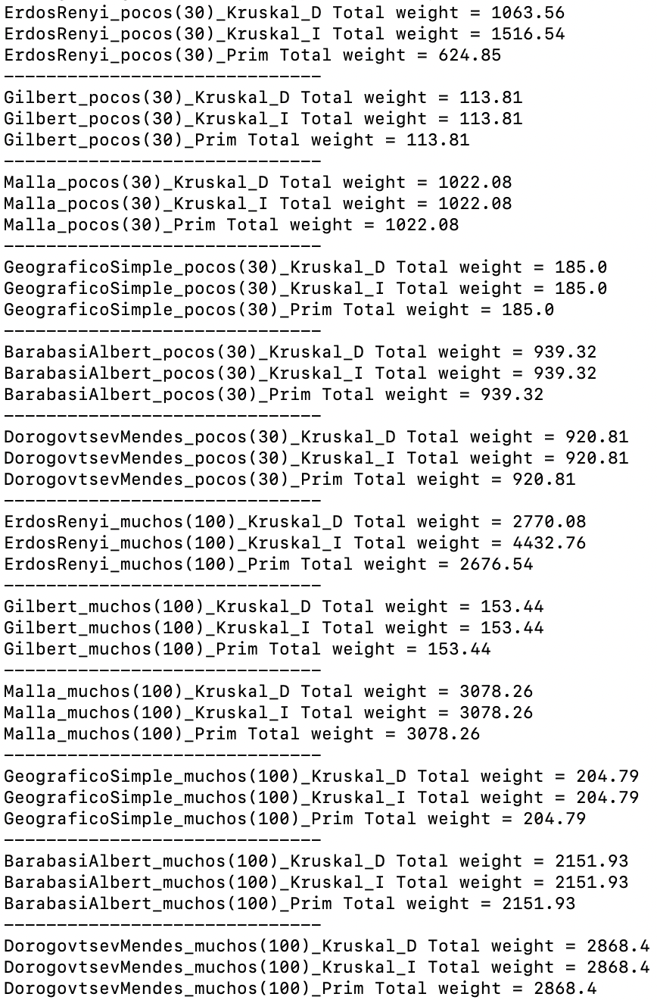

# GraphLibrary - Algoritmos Kruskal y Prim

### Isaí López García  
---

## Descripción

Este repositorio contiene el código del Proyecto 4 para aplicar el algoritmo de Kruskal Directo, el de Kruskal Indirecto y el de Prim a los grafos generados aleatoriamente con los algoritmos de generación aleatoria.

### Contenido del Repositorio

1. **Código:** Incluye los algoritmos y clases del proyecto anterior junto con los nuevos métodos de la clase Grafo llamados `Kruskal Directo`, `Kruskal Inverso`, `Prim`, calculan el árbol de mínima expansión para los grafos generados aleatoriamente.

  - **Main.py** Ejecuta todos los modelos de generación aleatoria de grafos para pocos nodos (30) y muchos nodos (100), y luego aplica cada uno de los 3 nuevos métodos de clase que exportan un archivo (.gv) cada uno, usados para visualizar el MST y para imprimir en consola el peso total de cada árbol de mínima expansión.

  - Aquí el resultado:
    
    

    **Nota:** Como se observa, el algoritmo Erdos Renyi hay una discrepancia en los pesos totales entre los MST generados por cada método, pero esto se debe a la forma en que se genera el grafo. Cuando se genera un grafo con Erdos Renyi se crean subgrafos no conexos entre sí, entonces cuando se aplica Kruskal o Prim y se toma algun arista arbitrario solo se geenra el árbol de mínima expansión de ese subgrafo.

2. **Archivos Generados:**
   
  - **GeneratedGraphs(gv)/**: Carpeta que contiene los archivos `.gv` generados por los algoritmos de generación aleatoria para 30 y 100 nodos.
  - **CalculatedGraphs(gv)/**: Carpeta que contiene los archivos `.gv` generados por los algoritmos Kruskal Directo, Kruskal Inverso y Prim aplicado a cada grafo de la carpeta mencionada anteriormente.

3. **Capturas de Pantalla:**
   
- **GeneratedGraphs(img)/**: Carpeta que contiene las imágenes generadas con Gephi a partir de los grafos de la carpeta GeneratedGraphs(gv)/.
- **CalculatedGraphs(img)/**: Carpeta que contiene las imágenes generadas con Gephi a partir de los grafos inducidos por cada uno de los nuevos métodos. 
