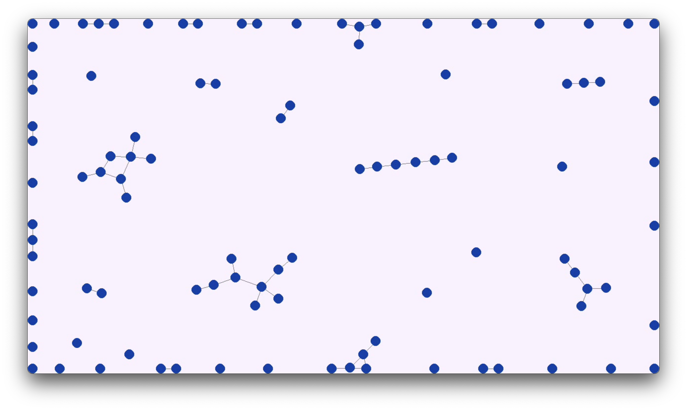
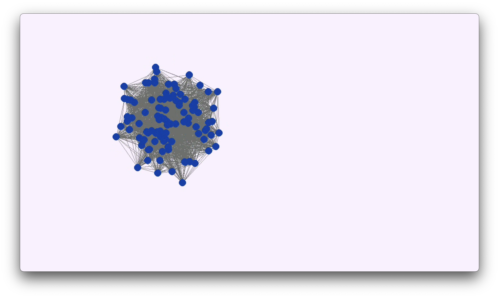
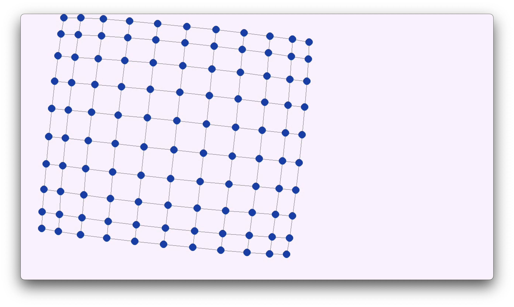
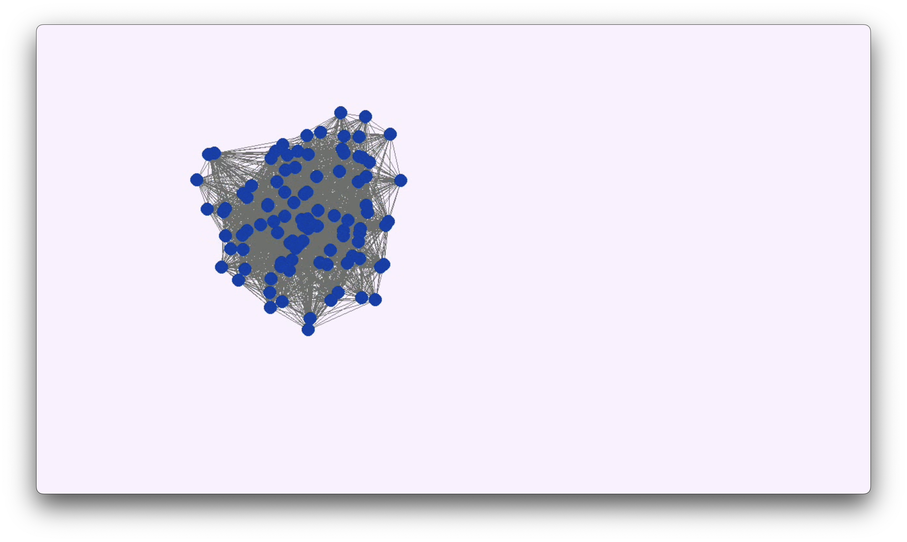
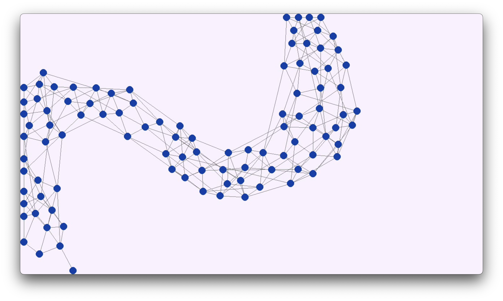
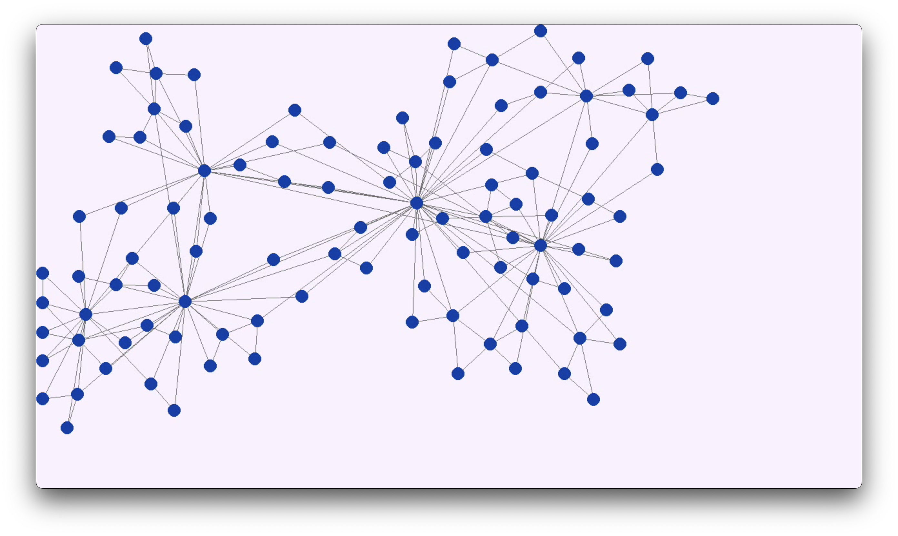
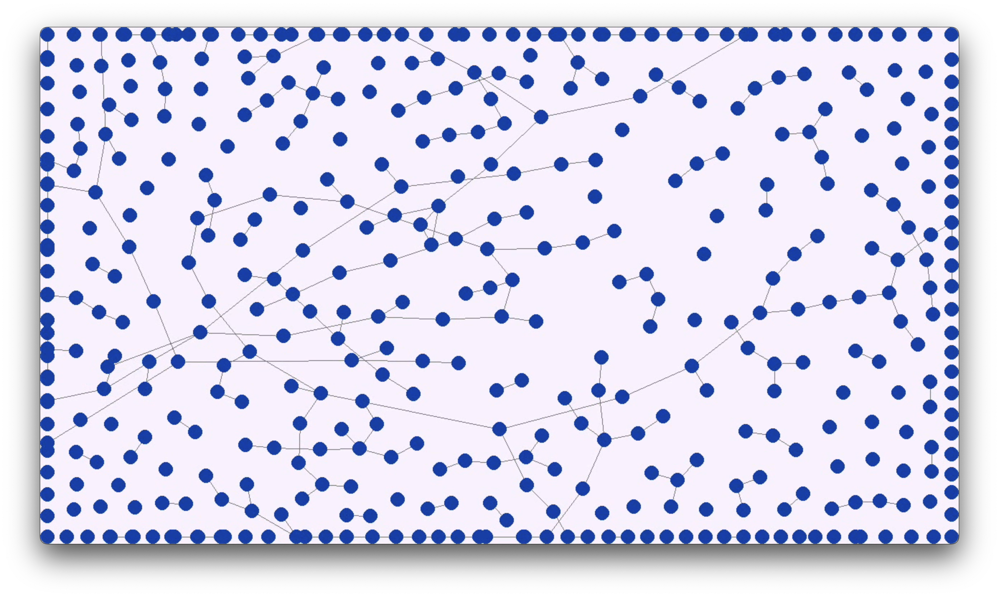
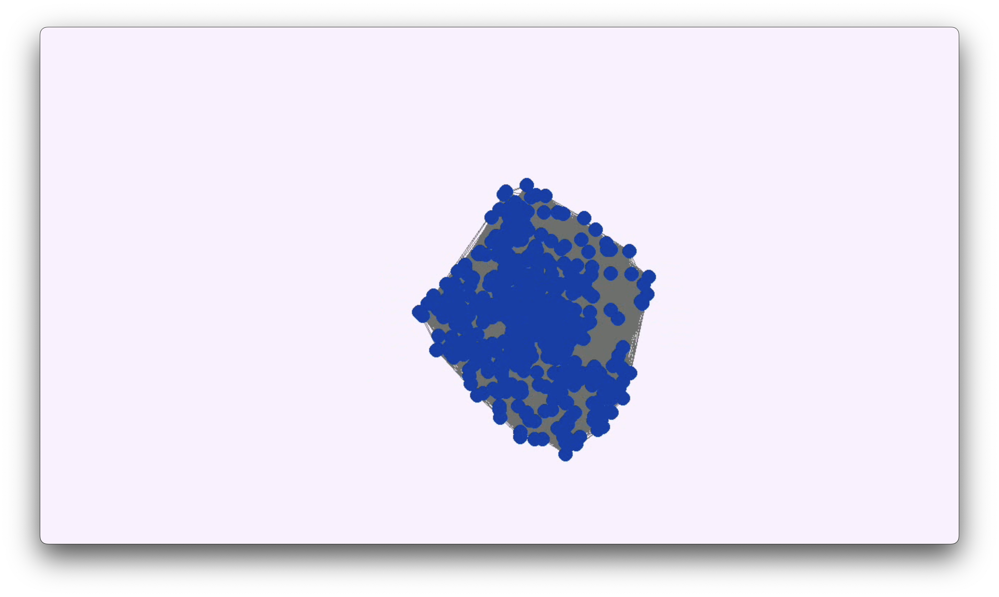
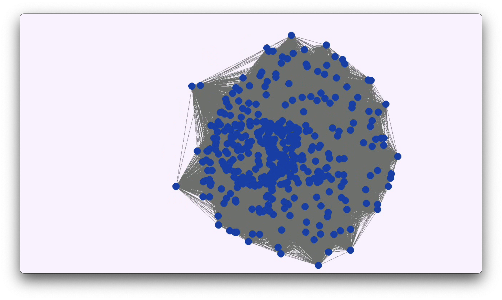

# GraphLibrary - Disposicion de Grafos I

### Isaí López García  
---

## Descripción

Este repositorio contiene el código del Proyecto 5 para la disposición de grafos mediante el método de resortes (Spring Layout) presentado por P. Eades (1984).

### Contenido del Repositorio

1. **Código:** Incluye los algoritmos de proyectos anteriores junto con una nueva clase llamada `App`, contenida en el archivo `graph-visualizer.py`. Esta clase implementa un método llamado `Spring method` para calcular la disposición de grafos.

2. **Archivos Generados:** En la carpeta `GeneratedGraphs(gv)` encontrarás archivos `.gv` creados por algoritmos de generación aleatoria. Hay dos archivos por generador:
   - Uno con 100 nodos.
   - Otro con 500 nodos.

2. **Capturas de Pantalla:** En la carpeta `Screenshots` encontrarás las capturas de las visualziaciones de los grafos creados por cada algoritmo de generación aleatoria. Hay dos imágenes por generador:
   - Uno con 100 nodos.
   - Otro con 500 nodos.

---

## Capturas de Pantalla y Videos

### Playlist con todas las visualizaciones  
[https://www.youtube.com/playlist?list=PLPK-TVgfOITGFjbUpV9pFPFgJyxxQQimP](https://www.youtube.com/playlist?list=PLPK-TVgfOITGFjbUpV9pFPFgJyxxQQimP)

### Visualizaciones para Grafos con 100 Nodos

1. **Erdos Renyi (100 nodos):**  
   [Video](https://youtu.be/5EduNS-xFJU)  
   

2. **Gilbert (100 nodos):**  
   [Video](https://youtu.be/MLsXHUOz6e4)  
   

3. **Malla (100 nodos):**  
   [Video](https://youtu.be/bi2WEQ5GANs)  
   

4. **Geográfico Simple (100 nodos):**  
   [Video](https://youtu.be/oog0NbcE_EE)  
   

5. **Barabasi Albert (100 nodos):**  
   [Video](https://youtu.be/Huorce3k1P8)  
   

6. **Dorogovtsev Mendes (100 nodos):**  
   [Video](https://youtu.be/fgtcIJD-aJM)  
   

---

### Visualizaciones para Grafos con 500 Nodos

1. **Erdos Renyi (500 nodos):**  
   [Video](https://youtu.be/s-WsNAkcmLI)  
   

2. **Gilbert (500 nodos):**  
   [Video](https://youtu.be/Y59tqj7AXpM)  
   

3. **Malla (500 nodos):**  
   [Video](https://youtu.be/T4qPPwqKUE0)  
   

4. **Geográfico Simple (500 nodos):**  
   [Video](https://youtu.be/waE75lSMPp8)  
   

5. **Barabasi Albert (500 nodos):**  
   [Video](https://youtu.be/YkWcyrPh_uY)  
   

6. **Dorogovtsev Mendes (500 nodos):**  
   [Video](https://youtu.be/W7dXZVRVlHM)  
   
